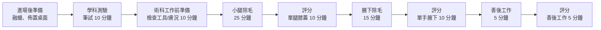
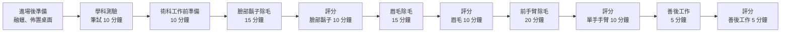
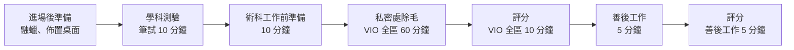

# IPE 熱蠟除毛技能技術檢定簡章 v5.0

## 一、測試項目

測試分**技能實作測試**和**學科測試**。各測試辦理單位於測試前，依規定時間分別將相關資料寄發給各監評人員或應檢人參考。

## 二、考試流程

報到 → 學科筆試 → 術科測試

## 三、學科檢定

1. 考試時間：學科時間 **20 分鐘**；考試方式：25 題，答錯不倒扣，一題 4 分。
    - **初級**：滿分 100 分，及格 60 分
    - **中級**：滿分 100 分，及格 70 分
    - **高級**：滿分 100 分，及格 80 分
2. 學科測驗開始 **5 分鐘後不准進場**，遲到視同缺考，學科以零分計。
3. 學科考試互相交談者，兩人皆以作弊論，兩人學科成績均以零分計。
4. 學科只可用原子筆作答（不可使用可擦拭原子筆），違者成績以零分計；可使用立可白/帶修正塗改。
5. 學科試卷上不可寫名字或註記不應有之文字、符號或標記，違者學科成績以零分計。
6. 學科成績不保留；若術科不及格，學科也必須重考。

## 四、術科檢定須知與注意事項

1. 應考人及模特兒須攜帶**身份證、駕照或健保卡**等附照片之正本證件備查，未攜帶者不得應考，以零分計。
2. 認證全程（含評分時間）應考者與模特兒**禁止使用手機**拍照、錄影；應考人手機響起（含震動），評審人員得請應考人立刻停止操作並離開考場，並登記為違規事項，該項成績扣 100 分。
3. 應考人所帶除毛產品應有**完整的中文標示**（未拆封使用之產品視同不合格），不可撕下原包裝改貼在應考產品上，只要有一項不合格扣總分 10 分。
4. 中文標產品包含：消毒用品、潔膚產品、蠟後清潔保養品、酒精等。
5. 應考人與模特兒除毛部位**不得配戴任何物品**，包含手錶、戒指、腳鍊，違者扣除毛術科總分 10 分。
6. 模特兒服裝可依應考部位穿著無袖或短褲。
7. 工作服**不可以有 LOGO**，顏色不拘，違者扣分。
8. **不可使用滾輪產品**應檢，違者成績以 0 分計，軟硬蠟不限。
9. 應考人工作區必須鋪設桌巾（可用美容床巾），須完全覆蓋桌面。
10. 考生須自備工作服、口罩及手套（每部位測試前須更換手套）、頭髮不得落下觸碰到模特兒，以及自備垃圾袋、待消毒袋，違者扣分。
11. 可使用夾子夾餘毛，不扣分；一位考生只有一個插孔，請自備延長線；一人最多只能準備兩台單爐蠟機。
12. 鑷子與安全圓頭剪刀需**獨立單包裝**，現場不得重複利用。
13. 不可與他人共用考試用品，違者視同作弊，以零分計。
14. 毛量不足者，違者扣 20 分（參閱參考照）。
15. 內鍋蠟量控制：不得超過木棒 3 公分高，違者扣 10 分。

---

## 五、術科檢定

### ● 初級檢定

<aside>
🟢

**初級：滿分 100 分，及格 60 分**

</aside>

#### 檢定須知

1. 進場後馬上個別開始融蠟 → 佈置桌面 → 學科 → 術科（術科開始蠟未融化不另給時間）
2. 術科時間：工作前準備 10 分 ＋ 單邊腿部正反面除毛 25 分 ＋ 單邊腋下除毛 15 分 ＋ 善後工作 5 分
3. 除毛部位不可有刺青，男女不拘

#### 考核部位與規範

| **部位** | **時間** | **範圍與毛量要求** |
| --- | --- | --- |
| 單邊腿部正反面 | 25 分鐘 | 膝上關節折線往上兩指至腳踝；毛髮長度 1–1.5cm，未達者不得應考 |
| 單邊腋下 | 15 分鐘 | 有毛範圍須涵蓋腋下面積達 5cm，長度 1–1.5cm，未達者不得應考 |

#### 操作要點

- **工作前準備**：檢查模特兒體毛面積、長度與膚況（皮膚須乾淨，無傳染皮膚病）、工具消毒完備
- **操作前**：雙手消毒清潔戴手套、皮膚清潔保護
- **操作中**：試溫、順毛上蠟、逆毛撕除、刮棒不回沾、保持皮膚繃緊
- **操作後**：清潔殘蠟、塗抹鎮定乳液、保持環境整潔

#### 初級考試流程

#### 初級術科工具表

| **項次** | **品項** | **數量** | **備註** |
| --- | --- | --- | --- |
| 1 | 酒精 | 1 瓶 | 中標檢查項目 |
| 2 | 軟、硬蠟產品 | 不限 | 中標檢查項目 |
| 3 | 術後保養品 | 1–3 罐 | 中標檢查項目 |
| 4 | 手套 | 適量 |  |
| 5 | 除毛布 | 適量 |  |
| 6 | 化妝棉 | 適量 |  |
| 7 | 木棒 | 適量 |  |
| 8 | 消毒袋 | 1 個 | 袋上請註明 |
| 9 | 垃圾袋 | 1 個 | 袋上請註明 |
| 10 | 工作服 | 1 件 |  |
| 11 | 鑷子 | 不限 |  |
| 12 | 安全圓頭剪刀 | 不限 |  |
| 13 | 紙巾 | 不限 |  |
| 14 | 融蠟鍋具 | 1 台 | 雙爐一台或單爐兩台 |
| 15 | 鋪床巾 | 適量 |  |

#### 初級評分標準與配分

| **評分項目** | **內容** | **配分標準** | **分工** |
| --- | --- | --- | --- |
| 1. 毛流上蠟方向正確 20% | 方向正確且連貫一致 | 大部分正確 18–20 分；2–3 次未正確 15–17 分；4 次以上 14 分以下 | 分區 |
| 2. 撕蠟方向正確 20% | 逆毛撕除、俐落不重覆 | 大部分符合 18–20 分；2–3 次未正確 15–17 分；4 次以上 14 分以下 | 分區 |
| 3. 拉皮動作確實 20% | 保持皮膚緊繃 | 大部分撐緊 18–20 分；2–3 次未撐緊 15–17 分；4 次以上 14 分以下 | 分區 |
| 4. 安撫速度及流暢度 10% | 柔和安撫、節奏穩定 | 大部分正確 9–10 分；2–3 次未安撫 7–8 分；4 次以上 6 分以下 | 共評 |
| 5. 刮棒不回沾 10% | 全程衛生規範符合 | 大部分正確 9–10 分；2–3 次未符合 7–8 分；重複回刮 3 次以上 6 分以下 | 分區 |
| 6. 上蠟均勻無缺角 5% | 厚薄一致 | 均勻 5 分；尚可 4 分；不均勻 3 分以下 | 分區 |
| 7. 試溫及控蠟動作 5% | 距離適當、滴蠟控制 | 未試溫扣 2 分；滴蠟扣 2 分 | 分區 |
| 8. 取蠟及轉蠟技巧 5% | 動作俐落無滴蠟 | 大部分正確 5 分；2–3 次未正確 4 分；4 次以上 3 分以下 | 分區 |
| 9. 操作前後擦拭及保養處理 5% | 清潔完整、保養適當 | 未清潔乾淨扣 2 分；未擦保養品扣 2 分；皆無扣 5 分 | 共評 |

<aside>
💡

**分工說明**：「分區」由負責該區域的評審獨立評分；「共評」由全體評審共同觀察後合議評分。

</aside>

#### 初級扣分項目

| **項次** | **項目內容** | **扣分** |
| --- | --- | --- |
| 1 | 漏毛 15 根以上（視同未完成） | 扣 100 分 |
| 2 | 漏毛 14 根內，每根扣 2 分 | 最高扣 28 分 |
| 3 | 燙傷模特兒應考部位 | 扣 100 分 |
| 4 | 鍋爐打翻 | 扣 30 分 |
| 5 | 衛生安全未落實（未更換剪刀、夾子、手套、口罩、桌/床巾、頭髮散落） | 任一項扣 10 分，最高扣 10 分 |
| 6 | 任一產品中標未標示、過期、無法辨識 | 任一項扣 10 分，最高扣 10 分 |
| 7 | 模特兒應考部位有餘蠟 | 每處扣 2 分，最高扣 5 分 |
| 8 | 無準備、放置錯誤垃圾袋/待消毒袋 | 每項扣 1 分，最高扣 2 分 |
| 9 | 儀容扣分：未穿工作服/模特未穿合適衣物/工作服有 LOGO | 每項扣 2 分，最高扣 5 分 |
| 10 | 應考人與模特兒除毛部位配戴任何物品 | 扣 10 分 |
| 11 | 指甲違規：考生指甲有立體造型/貼鑽，或長度長於指肉 0.2 公分 | 扣 20 分 |
| 12 | 毛量不足：模特兒應考部位未達最少毛量要求　| 扣 20 分 |
| 13 | 內鍋蠟量控制：不得超過木棒 3 公分高 | 扣 10 分 |
| 14 | 不可使用滾輪產品應檢，軟硬蠟不限 | 扣 100 分 |
| 15 | 應考人手機響起（含震動）| 扣 100 分 |

---

### ● 中級檢定

<aside>
🟡

**中級：滿分 100 分，及格 70 分**

</aside>

#### 檢定須知

1. 進場後馬上個別開始融蠟 → 佈置桌面 → 學科 → 術科（術科開始蠟未融化不另給時間）
2. 術科時間：工作前準備 10 分 ＋ 臉部鬍子 15 分 ＋ 眉毛 15 分 ＋ 單邊前手臂除毛 20 分 ＋ 善後工作 5 分
3. 檢查模特兒應考部位，未達最少毛量者不得應考，成績以零分計
4. 除毛部位不可有刺青，男女不拘（鬍子除外）

#### 考核部位與規範

| **部位** | **時間** | **範圍與毛量要求** |
| --- | --- | --- |
| 臉部鬍子 | 15 分鐘 | 模特兒限女性；上、下唇向外 1 公分，毛髮面積每邊不得少於 2*0.5 公分 |
| 眉毛 | 15 分鐘 | 眉頭至眉尾 >5*1cm，不得事先修剪；眉型除毛完成向外 0.5 公分，眉心需全除 |
| 單邊前手臂 | 20 分鐘 | 手肘折線上兩指至指關節；須達基本毛髮量 |

#### 中級考試流程

#### 中級術科工具表

| **項次** | **品項** | **數量** | **備註** |
| --- | --- | --- | --- |
| 1 | 酒精 | 1 瓶 | 中標檢查項目 |
| 2 | 軟、硬蠟產品 | 不限 | 中標檢查項目 |
| 3 | 術後保養品 | 1–3 罐 | 中標檢查項目 |
| 4 | 手套 | 適量 |  |
| 5 | 除毛布 | 適量 |  |
| 6 | 化妝棉 | 適量 |  |
| 7 | 木棒 | 適量 |  |
| 8 | 消毒袋 | 1 個 | 袋上請註明 |
| 9 | 垃圾袋 | 1 個 | 袋上請註明 |
| 10 | 工作服 | 1 件 |  |
| 11 | 鑷子 | 不限 |  |
| 12 | 安全圓頭剪刀 | 不限 |  |
| 13 | 紙巾 | 不限 |  |
| 14 | 融蠟鍋具 | 1 台 | 雙爐一台或單爐兩台 |
| 15 | 鋪床巾 | 適量 |  |

#### 中級評分標準與配分

| **評分項目** | **內容** | **配分標準** | **分工** |
| --- | --- | --- | --- |
| 1. 毛流上蠟方向正確 20% | 方向正確且連貫一致，臉部細微毛流需精準判斷 | 全程正確 18–20 分；1–2 次未正確 15–17 分；3 次以上 14 分以下 | 分區 |
| 2. 撕蠟方向正確 20% | 逆毛撕除、俐落不重覆，臉部需控制力道避免泛紅 | 全程符合 18–20 分；1–2 次未正確 15–17 分；3 次以上 14 分以下 | 分區 |
| 3. 拉皮動作確實 20% | 保持皮膚緊繃，眉周與唇周拉皮需更精細 | 全程撐緊 18–20 分；1–2 次未撐緊 15–17 分；3 次以上 14 分以下 | 分區 |
| 4. 安撫速度及流暢度 10% | 柔和安撫、節奏穩定，臉部操作需更輕柔 | 全程正確 9–10 分；1–2 次未安撫 7–8 分；3 次以上 6 分以下 | 共評 |
| 5. 刮棒不回沾 10% | 全程衛生規範符合 | 全程符合 9–10 分；1–2 次未符合 7–8 分；回沾 3 次以上 6 分以下 | 分區 |
| 6. 上蠟均勻無缺角 5% | 厚薄一致，臉部小範圍需更精準 | 均勻 5 分；尚可 4 分；不均勻 3 分以下 | 分區 |
| 7. 試溫及控蠟動作 5% | 距離適當、滴蠟控制，臉部溫度控制更嚴格 | 未試溫扣 2 分；滴蠟扣 2 分 | 分區 |
| 8. 取蠟及轉蠟技巧 5% | 動作俐落無滴蠟 | 全程正確 5 分；1–2 次未正確 4 分；3 次以上 3 分以下 | 分區 |
| 9. 操作前後擦拭及保養處理 5% | 清潔完整、保養適當 | 未清潔乾淨扣 2 分；未擦保養品扣 2 分；皆無扣 5 分 | 共評 |

<aside>
💡

**分工說明**：「分區」由負責該區域的評審獨立評分；「共評」由全體評審共同觀察後合議評分。

</aside>

#### 中級扣分項目

| **項次** | **項目內容** | **扣分** |
| --- | --- | --- |
| 1 | 漏毛 15 根以上（視同未完成） | 扣 100 分 |
| 2 | 漏毛 14 根內，每根扣 2 分 | 最高扣 28 分 |
| 3 | 斷毛 | 每根扣 1 分，最高扣 10 分 |
| 5 | 燙傷模特兒應考部位皮膚 | 扣 100 分 |
| 6 | 鍋爐打翻、環境凌亂 | 扣 30 分 |
| 7 | 模特兒應考部位有餘蠟 | 每處扣 2 分，最高扣 5 分 |
| 9 | 滴蠟、衣物沾蠟 | 每處扣 2 分，最高扣 5 分 |
| 10 | 衛生安全未落實（未更換剪刀、夾子、手套、口罩、桌/床巾、頭髮散落） | 任一項扣 10 分，最高扣 10 分 |
| 11 | 無準備、放置錯誤垃圾袋/待消毒袋 | 每項扣 1 分，最高扣 2 分 |
| 12 | 儀容扣分：未穿工作服/模特未穿合適衣物/工作服有 LOGO | 每項扣 2 分，最高扣 5 分 |
| 13 | 任一產品中標未標示/過期/無法辨識 | 任一項扣 10 分，最高扣 10 分 |
| 14 | 應考人與模特兒除毛部位配戴任何物品 | 扣 10 分 |
| 15 | 指甲違規：考生指甲有立體造型/貼鑽，或長度長於指肉 0.2 公分 | 扣 20 分 |

---

### ● 高級檢定

<aside>
🔴

**高級：滿分 100 分，及格 80 分**

</aside>

#### 檢定須知

1. 進場後馬上個別開始融蠟 → 佈置桌面 → 學科 → 術科（術科開始蠟未融化不另給時間）
2. 術科時間：工作前準備 10 分 ＋ 私密除巴西式全除（VIO）60 分 ＋ 善後工作 5 分
3. 檢查模特兒應考部位，未達最少毛量者不得應考，成績以零分計

#### 考核部位與規範

| **部位** | **時間** | **範圍與毛量要求** |
| --- | --- | --- |
| 私密除巴西式全除（VIO） | 60 分鐘 | 模特兒限女性；V（髂股、腹股溝為線倒三角形）＋ I（陰唇全區）＋ O（肛門口）；毛髮面積需有明顯毛及長度 |

#### 高級考試流程

#### 高級術科工具表

| **項次** | **品項** | **數量** | **備註** |
| --- | --- | --- | --- |
| 1 | 酒精 | 1 瓶 | 中標檢查項目 |
| 2 | **硬蠟**產品 | 不限 | 中標檢查項目 |
| 3 | 術後保養品 | 1–3 罐 | 中標檢查項目 |
| 4 | 手套 | 適量 |  |
| 5 | 除毛布 | 適量 |  |
| 6 | 化妝棉 | 適量 |  |
| 7 | 木棒 | 適量 |  |
| 8 | 消毒袋 | 1 個 | 袋上請註明 |
| 9 | 垃圾袋 | 1 個 | 袋上請註明 |
| 10 | 工作服 | 1 件 |  |
| 11 | 鑷子 | 不限 |  |
| 12 | 安全圓頭剪刀 | 不限 |  |
| 13 | 紙巾 | 不限 |  |
| 14 | 融蠟鍋具 | 1 台 | 雙爐一台或單爐兩台 |
| 15 | 鋪床巾 | 適量 |  |

#### 高級評分標準與配分

| **評分項目** | **內容** | **配分標準** | **分工** |
| --- | --- | --- | --- |
| 1. 毛流上蠟方向正確 20% | 方向正確且連貫一致，VIO 多方向毛流需即時判斷 | 全程精準 18–20 分；1 次未正確 15–17 分；2 次以上 14 分以下 | 分區 |
| 2. 撕蠟方向正確 20% | 逆毛撕除、俐落不重覆，私密處需精確控制力道 | 全程符合 18–20 分；1 次未正確 15–17 分；2 次以上 14 分以下 | 分區 |
| 3. 拉皮動作確實 20% | 保持皮膚緊繃，VIO 組織柔軟需更精確拉皮 | 全程撐緊 18–20 分；1 次未撐緊 15–17 分；2 次以上 14 分以下 | 分區 |
| 4. 安撫速度及流暢度 10% | 柔和安撫、節奏穩定，私密處需即時安撫緩解不適 | 全程正確 9–10 分；1 次未安撫 7–8 分；2 次以上 6 分以下 | 共評 |
| 5. 刮棒不回沾 10% | 全程衛生規範符合，零回沾 | 全程符合 9–10 分；1 次回沾 7–8 分；2 次以上 6 分以下 | 分區 |
| 6. 上蠟均勻無缺角 5% | 厚薄一致，VIO 複雜區域需更精確控制 | 均勻 5 分；尚可 4 分；不均勻 3 分以下 | 分區 |
| 7. 試溫及控蠟動作 5% | 距離適當、滴蠟控制，私密處溫度零容忍 | 未試溫扣 2 分；滴蠟扣 2 分 | 分區 |
| 8. 取蠟及轉蠟技巧 5% | 動作俐落無滴蠟 | 全程正確 5 分；1 次未正確 4 分；2 次以上 3 分以下 | 分區 |
| 9. 操作前後擦拭及保養處理 5% | 清潔完整、保養適當 | 未清潔乾淨扣 2 分；未擦保養品扣 2 分；皆無扣 5 分 | 共評 |

<aside>
💡

**分工說明**：「分區」由負責該區域的評審獨立評分；「共評」由全體評審共同觀察後合議評分。

</aside>

#### 高級扣分項目

| **項次** | **項目內容** | **扣分** |
| --- | --- | --- |
| 1 | 漏毛 15 根以上（視同未完成） | 扣 100 分 |
| 2 | 漏毛 14 根內，每根扣 2 分 | 最高扣 28 分 |
| 3 | 斷毛 15 根 | 每根扣 1 分，最高扣 15 分 |
| 5 | 燙傷模特兒應考部位皮膚 | 扣 100 分 |
| 6 | 鍋爐打翻、環境凌亂 | 扣 30 分 |
| 7 | 模特兒應考部位有餘蠟 | 每處扣 2 分，最高扣 5 分 |
| 9 | 滴蠟、衣物沾蠟 | 每處扣 2 分，最高扣 5 分 |
| 10 | 衛生安全未落實（未更換剪刀、夾子、手套、口罩、桌/床巾、頭髮散落） | 任一項扣 10 分，最高扣 10 分 |
| 11 | 無準備、放置錯誤垃圾袋/待消毒袋 | 每項扣 1 分，最高扣 2 分 |
| 12 | 儀容扣分：未穿工作服/模特未穿合適衣物/工作服有 LOGO | 每項扣 2 分，最高扣 5 分 |
| 13 | 任一產品中標未標示/過期/無法辨識 | 任一項扣 10 分，最高扣 10 分 |
| 14 | 指甲違規：考生指甲有立體造型/貼鑽，或長度長於指肉 0.2 公分 | 扣 20 分 |
| 15 | 應考人與模特兒除毛部位配戴任何物品 | 扣 10 分 |