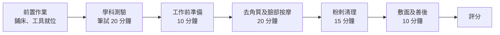
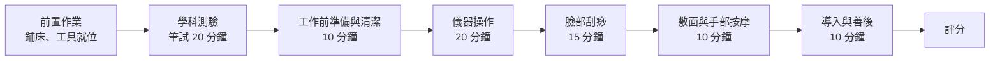
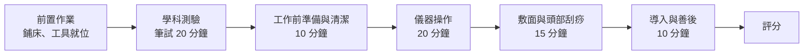

# IPE 皮膚管理檢定規範與評分標準 v1.0

## 一、學科測驗規範

1. 題庫規劃：總題庫 **100 題**。
2. 測驗標準：單選題 25 題，答錯不倒扣，一題 4 分。
    - **初級**：滿分 100 分，及格 60 分
    - **中級**：滿分 100 分，及格 70 分
    - **高級**：滿分 100 分，及格 80 分
3. 測試時間：**20 分鐘**。（學科測驗開始 **5 分鐘後不准進場**，遲到視同缺考，以零分計。）
4. 外籍考生友善機制：採「口述考試」。由秘書部隨機抽 25 題出卷，並預先製作「錄音檔」進行測驗。（於考前 2 周完成試卷出題及錄製）

## 二、檢定須知

### ● 模特兒規範

1. 須年滿 **15 歲**，男女不限，評分部位不得有刺青。
2. 不可配戴任何飾品、手錶、項鍊、戒指。
3. 請穿著**平口無 LOGO 美容衣**並於考試前更換完畢。

### ● 考生規範

1. 長髮必須扎馬尾或包頭，瀏海不得蓋到眼睛，全程需帶**口罩**。
2. 必須穿**無 LOGO 白色檢定工作服**，長度需及膝（裡面白上衣）。
3. 不可配戴任何飾品、手錶、項鍊、戒指。摘不下的手環必須用繃帶固定住，不得晃動即不扣分。
4. 指甲不可有立體造型/貼鑽，長度不長於指肉 **0.2 公分**。

### ● 場地與設備準備

1. 檢定使用美容產品與酒精必須要有**完整的中文標籤**。
2. 進場後先自行鋪床夾待消毒袋、垃圾袋、水盆備水、置濕毛巾於蒸氣消毒箱、美容檯燈等設備就位。
3. 自備考生及模特兒室內拖鞋。
4. 自備延長線及檯燈。（中高級另須自備皮膚管理綜合儀及美容儀等設備）

## 三、考場與設備規範

### ● 考場配置

- 每場地容納 **4～12 床**。
- 人力配置：每四床安排 **1 位評審**並配置 **1 位評審長**。
- 考場提供：美容床椅、工作推車、延長線、黑色化妝棉、皮膚管理顧客資料卡與 A4 版夾。

### ● 考生自備工具與耗材規定

1. 統一毛巾規定：必須使用「**奶茶色**」毛巾，需準備至少 **2 條大毛巾**與 **6 條小毛巾**。
2. 水盆配置：考生需預備 **2 盆水**（換水時可暫離考場至洗手間或教室水龍頭更換）。
3. 照明設備：考生必須「**自備美容檯燈**」。
4. 專業工具（初級）：
    - 粉刺工具：需準備 **2 種以上**（如粉刺針、粉刺夾、粉刺棒）。
    - 敷臉耗材：護眼墊（或化妝棉）、面膜紙、粉刺水等。
    - 面膜規定：必須使用「**有顏色、不可透膚（不可看到皮膚顏色）**」之面膜。
5. 專業儀器與工具（中級）：
    - 考生需自備**皮膚管理綜合儀**（包含小氣泡機、水飛梭、刮刀、導入儀器）。
    - **臉部刮痧板**與對應之**軟膜**耗材。
6. 專業儀器與工具（高級）：
    - 考生需自備**皮膚管理綜合儀**（包含 RF 射頻、冰垂、導入儀器）。
    - **頭部刮痧板**與對應之**軟膜**耗材。
7. 工具材料清單：參考各級別附件。

---

## 四、術科檢定

### ● 初級檢定

<aside>
🟢

**初級：滿分 100 分，及格 60 分**

</aside>

### 術科測驗流程（總時長：55 分鐘）

**【前置作業】** 鋪床、模特兒就位、工具就位、毛巾放置蒸氣消毒箱。（不計時，所有考生就位後開始計時。）

| **操作階段** | **時長** | **流程與檢核重點** | **配分** |
| --- | --- | --- | --- |
| 一、工作前準備 | 10 分鐘 | 1. 填寫皮膚管理顧客資料卡（所有欄位皆為必填，初階不需填寫臉部圖示）
2. 模特兒包頭並消毒雙手
3. 眼唇與全臉乾淨卸妝
4. 基礎清潔洗卸動作確實 | 15% |
| 【換水時間】 | 不計時 | 考生可離開考場至供水區更換水盆（考生不可交談） | — |
| 二、去角質及臉部按摩 | 20 分鐘 | 1. 按摩範圍必須包含：臉部、頸部、前胸、肩頸
2. 包含操作後之擦拭與清潔 | 40% |
| 【換水時間】 | 不計時 | 考生可離開考場至供水區更換水盆（考生不可交談） | — |
| 三、粉刺清理 | 15 分鐘 | 1. 含敷粉刺水、熱毛巾包覆
2. 工具與手部消毒
3. 手工清粉刺操作（粉刺放置考場提供之黑色化妝棉）
4. 清潔後拍打化妝水收斂 | 15% |
| 四、敷面及善後 | 10 分鐘 | 1. 敷面範圍：臉部至下顎（不可透膚）
2. 善後保養：卸除面膜、化妝水、精華液、乳液、隔離或防曬 | 20% |
| 五、整體觀感與重大扣分 | 全程 | 依據下方明確扣分標準執行 | 10% |

### 考試流程圖

### 初級評分標準與配分（滿分 100 分）

| **項次** | **評分項目** | **評分內容與標準** | **配分** | **分工** | **給分梯度參考** |
| --- | --- | --- | --- | --- | --- |
| 1 | 填寫顧客資料卡 | 全欄位必填、職業採勾選（初階免畫臉部圖） | 5 分 | 分區 | 完整填寫 5 分；漏填 1–2 欄 3–4 分；漏填 3 欄以上 2 分以下 |
| 2 | 卸妝、洗臉 | 眼唇與全臉乾淨卸除，動作確實不滴水 | 10 分 | 分區 | 卸除乾淨且動作流暢 9–10 分；局部殘留或略滴水 6–8 分；明顯殘妝或動作粗糙 5 分以下 |
| 3 | 去角質 | 溫和操作，不拉扯皮膚，擦拭乾淨無殘留 | 10 分 | 分區 | 操作溫和且無殘留 9–10 分；輕微拉扯或少量殘留 6–8 分；明顯拉扯或大面積殘留 5 分以下 |
| 4 | 臉部勻油／按摩技能 | 含額頭、眼、鼻子、臉頰、下巴、脖子、前胸肩頸耳朵按摩技能 | 10 分 | 分區 | 全區域涵蓋且手法正確 9–10 分；遺漏 1–2 部位或手法略偏 6–8 分；遺漏多處或手法錯誤 5 分以下 |
| 5 | 臉部按摩技能 | 手技服貼／柔軟／按摩順暢有韻律 | 10 分 | 共評 | 服貼柔軟且節奏穩定 9–10 分；偶有中斷或力道不均 6–8 分；手技僵硬或節奏凌亂 5 分以下 |
| 6 | 前胸肩頸按摩技能 | 涵蓋前胸與肩頸，雙手不隨意離開身體 | 10 分 | 共評 | 全程手不離身且範圍完整 9–10 分；偶爾離手或遺漏局部 6–8 分；頻繁離手或範圍不足 5 分以下 |
| 7 | 清粉刺前置工作 | 敷粉刺水、熱毛巾包覆，手與工具確實酒精消毒 | 5 分 | 分區 | 流程完整且消毒確實 5 分；遺漏一項步驟 3–4 分；多項遺漏 2 分以下 |
| 8 | 清粉刺技能 | 需備 2 種以上工具，挑粉刺精準，無硬擠發炎痘痘 | 10 分 | 分區 | 手法精準且工具運用得當 9–10 分；偶有不精準或工具選用不佳 6–8 分；硬擠或工具不足 5 分以下 |
| 9 | 敷臉面膜流程與技能 | 面膜有顏色、不可透膚，必須敷至下顎 | 10 分 | 分區 | 敷面均勻且範圍完整至下顎 9–10 分；厚度略不均或範圍稍不足 6–8 分；透膚或未達下顎 5 分以下 |
| 10 | 面膜後清潔與善後 | 面膜卸除乾淨，擦拭化妝水／精華液／乳液／隔離防曬 | 10 分 | 分區 | 卸除乾淨且保養步驟完整 9–10 分；局部殘留或遺漏 1 項保養 6–8 分；殘留明顯或遺漏多項 5 分以下 |
| 11 | 全程操作技術熟練度 | 姿勢符合人體工學，桌面整潔，態度從容親切 | 10 分 | 共評 | 從容自信且環境整潔 9–10 分；偶有慌亂或桌面稍凌亂 6–8 分；明顯緊張或環境雜亂 5 分以下 |
|  | **技術考核小計** |  | **100 分** |  |  |

<aside>
💡

**分工說明**：「分區」由負責該區域的評審獨立評分；「共評」由全體評審共同觀察後合議評分。

</aside>

#### 初級明確扣分標準

為確保評審標準一致，除各階段技術評分外，以下違規將直接扣減總分：

| **違規項目** | **違規情節說明** | **扣分** |
| --- | --- | --- |
| 應考期間手機鬧鈴響起 | 考生或模特兒手機響起（重大違規） | 扣 100 分 |
| 造成顧客受傷 | 使用錯誤技法造成受傷或操作錯誤部位（重大違規） | 扣 30 分 |
| 指甲違規 | 考生雙手有立體造型/貼鑽，或長度長於指肉 0.2 公分 | 扣 20 分 |
| 毛巾違規 | 全部毛巾非單一素色（未統一使用奶茶色） | 扣 10 分 |
| 飾品違規 | 考生及模特兒配戴任何飾品、手錶、項鍊、戒指 | 扣 10 分 |
| 面膜違規 | 面膜顏色透明、厚度可看見原本膚色，或未敷至下顎 | 扣 10 分 |
| 隱私曝光違規 | 未正確使用毛巾，使模特兒胸前美容衣曝光 | 扣 10 分 |
| 按摩手技方向錯誤 | 操作過程按摩畫圈方向錯誤或過度拉扯 | 扣 10 分 |
| 產品標示違規 | 產品中文標示不完整或過期（一項扣 2 分，最多扣 10 分） | 扣 10 分 |
| 服儀違規（考生） | 考生未穿規定工作服 | 扣 5 分 |
| 服儀違規（模特兒） | 模特兒未穿素色美容衣、或不符合規定 | 扣 5 分 |
| 包頭違規 | 操作時模特兒頭髮未用毛巾包好 | 扣 5 分 |
| 衛生違規 | 工作前手部未消毒、未戴口罩、頭髮未紮好 | 扣 5 分 |
| 垃圾袋/消毒袋違規 | 未準備或未標示垃圾袋、待消毒袋、大待消毒袋 | 扣 5 分 |
| 桌面整潔違規 | 工具使用未清潔擺放整齊 | 扣 5 分 |

**技術性扣分項目**

以下為操作過程中的技術性違規，由評審於各階段評分時一併記錄，自總分額外扣除：

| **違規項目** | **違規情節說明** | **扣分** |
| --- | --- | --- |
| 硬擠發炎痘痘 | 對明顯發炎、紅腫痘痘強行擠壓，造成紅腫加劇或出血 | 每處扣 3 分，最高扣 15 分 |
| 面膜殘留未清除 | 善後階段完成後，模特兒臉部仍有可見面膜殘留 | 每處扣 2 分，最高扣 10 分 |
| 去角質產品殘留於敢感部位 | 去角質產品殘留於眼周、唇角等敢感部位未清除 | 扣 5 分 |
| 按摩力道過重 | 操作過程中按摩力道過重，造成模特兒明顯不適或皮膚泛紅 | 扣 5 分 |
| 粉刺工具未消毒即使用 | 更換工具時未重新酒精消毒即接觸皮膚 | 每次扣 2 分，最高扣 10 分 |
| 善後保養步驟不完整 | 遺漏化妝水、精華液、乳液、隔離防曬中任一項以上 | 每項扣 2 分，最高扣 8 分 |

#### 初級術科工具材料清單

| **項次** | **品項** | **數量** | **項次** | **品項** | **數量** |
| --- | --- | --- | --- | --- | --- |
| 1 | 工作服 | 1 | 21 | 粉刺夾 | 1 |
| 2 | 平口美容衣 | 1 | 22 | 擠痘棒 | 1 |
| 3 | 室內拖鞋 | 2 | 23 | 洗面乳 | 1 |
| 4 | 待消毒袋．垃圾袋 | 1 | 24 | 眼唇卸妝液 | 1 |
| 5 | 山口夾 | 2 | 25 | 卸妝乳 | 1 |
| 6 | 工具籃 | 1 | 26 | 去角質霜 | 1 |
| 7 | 置物架 | 1 | 27 | 粉刺水 | 1 |
| 8 | 鐵盤 | 1 | 28 | 化妝水 | 1 |
| 9 | 分納收納盒 | 1 | 29 | 按摩霜 | 1 |
| 10 | 洗臉巾 | 數張 | 30 | 敷臉霜（有顏色） | 1 |
| 11 | 化妝棉 | 數張 | 31 | 乳液 | 1 |
| 12 | 棉花棒 | 數支 | 32 | 隔離或防曬霜 | 1 |
| 13 | 面膜紙 | 數張 | 33 | 75% 酒精噴瓶 | 1 |
| 14 | 鋪床巾（奶茶色） | 2 | 34 | 檯燈 | 1 |
| 15 | 小毛巾（奶茶色） | 6 | 35 | 延長線 | 1 |
| 16 | 敷臉刷 | 2 | 36 | 枕頭 | 1 |
| 17 | 水盆 | 2 | 37 | 口罩 | 操作時須配戴 |
| 18 | 美容缽 | 3 | 38 | 原子筆 | 1 |
| 19 | 塑膠挖棒 | 5 |  |  |  |
| 20 | 粉刺針 | 1 |  |  |  |

---

### ● 中級檢定

<aside>
🟡

**中級：滿分 100 分，及格 70 分**

</aside>

#### 術科測驗流程（總時長：65 分鐘）

**【前置作業】** 鋪床、模特兒就位、工具與儀器就位。（不計時，所有考生就位後開始計時。）

| **操作階段** | **時長** | **流程與檢核重點** | **配分** |
| --- | --- | --- | --- |
| 一、工作前準備與清潔 | 10 分鐘 | 1. 填寫皮膚管理顧客資料卡（所有欄位皆為必填，中級須填寫臉部圖示）
2. 模特兒包頭並消毒雙手
3. 眼唇與全臉乾淨卸妝
4. 基礎清潔洗卸動作確實 | 15% |
| 【換水時間】 | 不計時 | 考生可離開考場至供水區更換水盆（考生不可交談） | — |
| 二、儀器操作 | 20 分鐘 | 1. 消毒儀器並操作小氣泡機
2. 操作水飛梭
3. 刮刀操作
4. 擦拭乾淨後拍打化妝水 | 20% |
| 三、臉部刮痧 | 15 分鐘 | 1. 勻油
2. 臉部開穴及臉部刮痧
3. 擦拭乾淨 | 20% |
| 【換水時間】 | 不計時 | 考生可離開考場至供水區更換水盆（考生不可交談） | — |
| 四、敷面與手部按摩 | 10 分鐘 | 1. 軟膜敷臉
2. 敷面期間進行手部按摩 | 20% |
| 五、導入與善後工作 | 10 分鐘 | 1. 導入保養
2. 後續保養與防曬（化妝水/精華/乳液/隔離）
3. 善後工作與場地復原 | 15% |
| 六、整體觀感與重大扣分 | 全程 | 依據下方明確扣分標準執行 | 10% |

#### 考試流程圖

#### 中級評分標準與配分（滿分 100 分）

| **項次** | **評分項目** | **評分內容與標準** | **配分** | **分工** | **給分梯度參考** |
| --- | --- | --- | --- | --- | --- |
| 1 | 填寫顧客資料卡 | 全欄位必填、職業採勾選，必須確實標示臉部膚況圖示 | 5 分 | 分區 | 完整填寫含圖示 5 分；漏填 1–2 欄 3–4 分；漏填 3 欄以上或未畫圖示 2 分以下 |
| 2 | 卸妝與洗臉 | 模特兒包頭確實，眼唇與全臉乾淨卸除，動作確實不滴水 | 10 分 | 分區 | 包頭確實且卸除乾淨 9–10 分；局部殘留或略滴水 6–8 分；明顯殘妝或動作粗糙 5 分以下 |
| 3 | 儀器操作(一)：水飛梭探頭技能 | 儀器確實消毒，吸力控制得當，不拉扯皮膚，無紅腫破皮 | 10 分 | 共評 | 消毒確實且吸力控制得當 9–10 分；吸力稍偏或局部拉扯 6–8 分；操作錯誤或造成紅腫 5 分以下 |
| 4 | 儀器操作(二)：剷皮探頭技能 | 刮刀角度正確不刮傷皮膚，擦拭全臉乾淨並拍打化妝水 | 10 分 | 分區 | 角度正確且擦拭乾淨 9–10 分；角度偏差或擦拭不完全 6–8 分；刮傷皮膚或操作錯誤 5 分以下 |
| 5 | 臉部刮痧(一)：勻油與開穴 | 按摩油塗抹均勻，臉部穴位點按精準到位 | 10 分 | 分區 | 勻油均勻且穴位精準 9–10 分；局部不均或穴位偏差 6–8 分；明顯不足 5 分以下 |
| 6 | 臉部刮痧(二)：刮痧技能 | 刮痧板角度與服貼度佳，方向正確不來回刮，力度適中後擦乾 | 10 分 | 共評 | 角度服貼且方向正確 9–10 分；偶有方向錯誤或力道不均 6–8 分；來回刮或拉扯皮膚 5 分以下 |
| 7 | 軟膜敷臉流程與技能 | 調膜比例正確不滴落，塗抹厚度均勻，避開鼻孔，邊緣整齊 | 10 分 | 分區 | 比例正確且敷面均勻 9–10 分；厚薄略不均或邊緣不齊 6–8 分；大面積滴落或覆蓋鼻孔 5 分以下 |
| 8 | 敷面期間手部按摩 | 於敷膜等待期間進行，手技服貼、柔軟，按摩順暢有韻律 | 10 分 | 分區 | 手技服貼且節奏穩定 9–10 分；手法略生疏或力道不均 6–8 分；手法錯誤或未完成 5 分以下 |
| 9 | 導入保養與善後清潔 | 軟膜卸除乾淨無殘留，使用導入儀器進行保養（5 分鐘）動作確實 | 10 分 | 分區 | 卸除乾淨且導入確實 9–10 分；局部殘留或導入不完整 6–8 分；殘留明顯或導入錯誤 5 分以下 |
| 10 | 善後工作與場地復原 | 流程結束後桌面清潔、儀器歸位、垃圾與待消毒物品分類正確 | 5 分 | 分區 | 場地整潔且分類正確 5 分；部分凌亂或分類有誤 3–4 分；場地雜亂 2 分以下 |
| 11 | 全程操作技術熟練度 | 姿勢符合人體工學，桌面整潔，儀器切換流暢，態度從容親切 | 10 分 | 共評 | 從容自信且儀器切換流暢 9–10 分；偶有慌亂或切換卡頓 6–8 分；明顯緊張或環境雜亂 5 分以下 |
|  | **技術考核小計** |  | **100 分** |  |  |

<aside>
💡

**分工說明**：「分區」由負責該區域的評審獨立評分；「共評」由全體評審共同觀察後合議評分。

</aside>

#### 中級明確扣分標準

為確保評審標準一致，除各階段技術評分外，以下違規將直接扣減總分：

| **違規項目** | **違規情節說明** | **扣分** |
| --- | --- | --- |
| 應考期間手機鬧鈴響起 | 考生或模特兒手機響起（重大違規） | 扣 100 分 |
| 造成顧客受傷 | 使用錯誤技法或儀器操作不當造成紅腫、刮傷或破皮（重大違規） | 扣 30 分 |
| 指甲違規 | 考生雙手有立體造型/貼鑽，或長度長於指肉 0.2 公分 | 扣 20 分 |
| 毛巾違規 | 全部毛巾非單一素色（未統一使用奶茶色） | 扣 10 分 |
| 飾品違規 | 考生及模特兒配戴任何飾品、手錶、項鍊、戒指 | 扣 10 分 |
| 刺青違規 | 模特兒操作部位有刺青（前胸以上） | 扣 10 分 |
| 隱私曝光違規 | 未正確使用毛巾，使模特兒胸前美容衣曝光 | 扣 10 分 |
| 儀器操作違規 | 儀器探頭未消毒、吸力/震動強度設定錯誤導致模特兒明顯不適 | 扣 10 分 |
| 軟膜操作違規 | 軟膜大面積滴落衣物/床鋪、覆蓋住鼻孔導致呼吸困難、或完全無法成型撕除 | 扣 10 分 |
| 刮痧手技方向錯誤 | 刮痧方向錯誤（如來回刮）、過度用力拉扯皮膚 | 扣 10 分 |
| 產品標示違規 | 產品中文標示不完整或過期（一項扣 2 分，最多扣 10 分） | 扣 10 分 |
| 服儀違規（考生） | 考生未穿規定工作服 | 扣 5 分 |
| 服儀違規（模特兒） | 模特兒未穿素色美容衣、或不符合規定 | 扣 5 分 |
| 包頭違規 | 操作時模特兒頭髮未用毛巾包好 | 扣 5 分 |
| 衛生違規 | 工作前手部未消毒、未戴口罩、頭髮未紮好 | 扣 5 分 |
| 垃圾袋/消毒袋違規 | 未準備或未標示垃圾袋、待消毒袋、大待消毒袋 | 扣 5 分 |
| 桌面整潔違規 | 工具使用未清潔擺放整齊 | 扣 5 分 |

#### 中級術科工具材料清單

| **項次** | **品項** | **數量** | **項次** | **品項** | **數量** |
| --- | --- | --- | --- | --- | --- |
| 1 | 工作服 | 1 | 21 | 皮膚管理綜合儀（六合一） | 1 |
| 2 | 平口美容衣 | 1 | 22 | 臉部刮痧板 | 1 |
| 3 | 室內拖鞋 | 2 | 23 | 洗面乳 | 1 |
| 4 | 待消毒袋．垃圾袋 | 1 | 24 | 眼唇卸妝液 | 1 |
| 5 | 山口夾 | 2 | 25 | 卸妝乳 | 1 |
| 6 | 工具籃 | 1 | 26 | 化妝水 | 1 |
| 7 | 置物架 | 1 | 27 | 按摩霜 | 1 |
| 8 | 鐵盤 | 1 | 28 | 軟膜粉 | 1 |
| 9 | 分納收納盒 | 1 | 29 | 乳液 | 1 |
| 10 | 洗臉巾 | 數張 | 30 | 隔離或防曬霜 | 1 |
| 11 | 化妝棉 | 數張 | 31 | 75% 酒精噴瓶 | 1 |
| 12 | 棉花棒 | 數支 | 32 | 護手霜 | 1 |
| 13 | 面膜紙 | 數張 | 33 | 檯燈 | 1 |
| 14 | 鋪床巾（奶茶色） | 2 | 34 | 延長線 | 1 |
| 15 | 小毛巾（奶茶色） | 6 | 35 | 枕頭 | 1 |
| 16 | 敷臉刷 | 2 | 36 | 口罩 | 操作時須配戴 |
| 17 | 水盆 | 2 | 37 | 原子筆 | 1 |
| 18 | 美容缽 | 3 |  |  |  |
| 19 | 塑膠挖棒 | 5 |  |  |  |
| 20 | 軟膜碗與大挖棒 | 1 |  |  |  |

---

### ● 高級檢定

<aside>
🔴

**高級：滿分 100 分，及格 80 分（術科及格 60 分）**

</aside>

#### 術科測驗流程（總時長：55 分鐘）

**【前置作業】** 鋪床、模特兒就位、工具與儀器就位。（不計時，所有考生就位後開始計時。）

| **操作階段** | **時長** | **流程與檢核重點** | **配分** |
| --- | --- | --- | --- |
| 一、工作前準備與清潔 | 10 分鐘 | 1. 填寫皮膚管理顧客資料卡（所有欄位皆為必填，高級須精準繪製臉部圖示並寫出高階護理/儀器建議）
2. 模特兒包頭並消毒雙手
3. 眼唇與全臉乾淨卸妝
4. 基礎清潔洗卸動作確實 | 20% |
| 【換水時間】 | 不計時 | 考生可離開考場至供水區更換水盆（考生不可交談） | — |
| 二、儀器操作 | 20 分鐘 | 1. 臉部勻油及開穴
2. 操作 RF 射頻及冰垂
3. 擦拭乾淨後拍打化妝水 | 30% |
| 【換水時間】 | 不計時 | 考生可離開考場至供水區更換水盆（考生不可交談） | — |
| 三、敷面與頭部刮痧 | 15 分鐘 | 1. 軟膜敷臉
2. 敷面期間進行頭部刮痧 | 20% |
| 四、導入與善後工作 | 10 分鐘 | 1. 導入保養
2. 後續保養與防曬（化妝水/精華/乳液/隔離）
3. 善後工作與場地復原 | 20% |
| 五、整體觀感與重大扣分 | 全程 | 依據下方明確扣分標準執行 | 10% |

#### 考試流程圖

#### 高級評分標準與配分（滿分 100 分）

| **項次** | **評分項目** | **評分內容與標準** | **配分** | **分工** | **給分梯度參考** |
| --- | --- | --- | --- | --- | --- |
| 1 | 填寫顧客資料卡 | 全欄位必填。須精準繪製臉部肌膚問題位置圖，並寫出高階護理/儀器建議 | 10 分 | 分區 | 圖示精準且建議完整 9–10 分；圖示或建議略有不足 6–8 分；未畫圖示或無建議 5 分以下 |
| 2 | 卸妝與洗臉 | 模特兒包頭確實，眼唇與全臉乾淨卸除，動作確實不滴水 | 10 分 | 分區 | 包頭確實且卸除乾淨 9–10 分；局部殘留或略滴水 6–8 分；明顯殘妝或動作粗糙 5 分以下 |
| 3 | 臉部：勻油與開穴技能 | 按摩油塗抹均勻，臉部穴位點按精準到位 | 10 分 | 共評 | 勻油均勻且穴位精準 9–10 分；局部不均或穴位偏差 6–8 分；明顯不足 5 分以下 |
| 4 | 儀器操作(一)：RF 探頭技能 | 著重向上拉提，方向正確，嚴禁向下過度拉扯皮膚產生皺褶 | 10 分 | 共評 | 方向正確且拉提到位 9–10 分；偶有方向偏差或力道不均 6–8 分；向下拉扯或產生皺褶 5 分以下 |
| 5 | 儀器操作(二)：冰槌探頭技能 | 儀器探頭確實消毒，操作角度與力道平穩，精華液導入均勻，無紅腫刮傷 | 10 分 | 分區 | 消毒確實且導入均勻 9–10 分；角度偏差或導入不均 6–8 分；操作錯誤或造成紅腫 5 分以下 |
| 6 | 軟膜敷臉流程與技能 | 調膜比例正確不滴落，塗抹厚度均勻，避開呼吸道（鼻孔），邊緣整齊 | 10 分 | 分區 | 比例正確且敷面均勻 9–10 分；厚薄略不均或邊緣不齊 6–8 分；大面積滴落或覆蓋鼻孔 5 分以下 |
| 7 | 敷面期間頭部刮痧 | 於敷膜等待期間進行。刮痧方向正確，穴點到位，無過度用力拉扯頭髮 | 10 分 | 共評 | 方向正確且穴點到位 9–10 分；偶有方向偏差或力道不均 6–8 分；方向錯誤或拉扯頭髮 5 分以下 |
| 8 | 卸膜與後續保養防曬 | 倒膜卸除乾淨無殘留，依序擦拭化妝水/精華液/乳液/隔離防曬 | 10 分 | 分區 | 卸除乾淨且保養完整 9–10 分；局部殘留或遺漏 1 項 6–8 分；殘留明顯或遺漏多項 5 分以下 |
| 9 | 善後工作與場地復原 | 流程結束後桌面清潔、儀器歸位、垃圾與待消毒物品分類正確 | 10 分 | 分區 | 場地整潔且分類正確 9–10 分；部分凌亂或分類有誤 6–8 分；場地雜亂 5 分以下 |
| 10 | 全程操作技術熟練度 | 姿勢符合人體工學，桌面整潔，儀器與手技切換流暢，展現高階專業氣勢 | 10 分 | 分區 | 從容自信且展現專業氣勢 9–10 分；偶有慌亂或切換卡頓 6–8 分；明顯緊張或環境雜亂 5 分以下 |
|  | **技術考核小計** |  | **100 分** |  |  |

<aside>
💡

**分工說明**：「分區」由負責該區域的評審獨立評分；「共評」由全體評審共同觀察後合議評分。

</aside>

#### 高級明確扣分標準

為確保評審標準一致，除各階段技術評分外，以下違規將直接扣減總分：

| **違規項目** | **違規情節說明** | **扣分** |
| --- | --- | --- |
| 應考期間手機鬧鈴響起 | 考生或模特兒手機響起（重大違規） | 扣 100 分 |
| 造成顧客受傷 | 使用錯誤技法或儀器操作不當造成紅腫、刮傷或破皮（重大違規） | 扣 30 分 |
| 指甲違規 | 考生雙手有立體造型/貼鑽，或長度長於指肉 0.2 公分 | 扣 20 分 |
| 毛巾違規 | 全部毛巾非單一素色（未統一使用奶茶色） | 扣 10 分 |
| 飾品違規 | 考生及模特兒配戴任何飾品、手錶、項鍊、戒指 | 扣 10 分 |
| 刺青違規 | 模特兒操作部位有刺青（前胸以上） | 扣 10 分 |
| 隱私曝光違規 | 未正確使用毛巾，使模特兒胸前美容衣曝光 | 扣 10 分 |
| 儀器操作違規 | 儀器探頭未消毒、吸力/震動強度設定錯誤導致模特兒明顯不適 | 扣 10 分 |
| 軟膜操作違規 | 軟膜大面積滴落衣物/床鋪、覆蓋住鼻孔導致呼吸困難、或完全無法成型撕除 | 扣 10 分 |
| 按摩/頭刮手技方向錯誤 | 臉按摩方向錯誤向下扯、頭皮刮痧過度用力拉扯 | 扣 10 分 |
| 產品標示違規 | 產品中文標示不完整或過期（一項扣 2 分，最多扣 10 分） | 扣 10 分 |
| 服儀違規（考生） | 考生未穿規定工作服 | 扣 5 分 |
| 服儀違規（模特兒） | 模特兒未穿素色美容衣、或不符合規定 | 扣 5 分 |
| 包頭違規 | 操作時模特兒頭髮未用毛巾包好 | 扣 5 分 |
| 衛生違規 | 工作前手部未消毒、未戴口罩、頭髮未紮好 | 扣 5 分 |
| 垃圾袋/消毒袋違規 | 未準備或未標示垃圾袋、待消毒袋、大待消毒袋 | 扣 5 分 |
| 桌面整潔違規 | 工具使用未清潔擺放整齊 | 扣 5 分 |

<aside>
📝

**備註**：為簡化考場行政，現場以本「評分總表」為主要依據。詳細的各項技術評分標準（細部動作規範）將另收錄於《評審班訓練手冊》中供考官培訓使用。

</aside>

#### 高級術科工具材料清單

| **項次** | **品項** | **數量** | **項次** | **品項** | **數量** |
| --- | --- | --- | --- | --- | --- |
| 1 | 工作服 | 1 | 21 | 皮膚管理綜合儀（六合一） | 1 |
| 2 | 平口美容衣 | 1 | 22 | 頭部刮痧板 | 1 |
| 3 | 室內拖鞋 | 2 | 23 | 洗面乳 | 1 |
| 4 | 待消毒袋．垃圾袋 | 1 | 24 | 眼唇卸妝液 | 1 |
| 5 | 山口夾 | 2 | 25 | 卸妝乳 | 1 |
| 6 | 工具籃 | 1 | 26 | 按摩霜 | 1 |
| 7 | 置物架 | 1 | 27 | 軟膜粉 | 1 |
| 8 | 鐵盤 | 1 | 28 | 乳液 | 1 |
| 9 | 分納收納盒 | 1 | 29 | 隔離或防曬霜 | 1 |
| 10 | 洗臉巾 | 數張 | 30 | 75% 酒精噴瓶 | 1 |
| 11 | 化妝棉 | 數張 | 31 | 檯燈 | 1 |
| 12 | 棉花棒 | 數支 | 32 | 延長線 | 1 |
| 13 | 面膜紙 | 數張 | 33 | 枕頭 | 1 |
| 14 | 鋪床巾（奶茶色） | 2 | 34 | 口罩 | 操作時須配戴 |
| 15 | 小毛巾（奶茶色） | 6 | 35 | 原子筆 | 1 |
| 16 | 敷臉刷 | 2 |  |  |  |
| 17 | 水盆 | 2 |  |  |  |
| 18 | 美容缽 | 3 |  |  |  |
| 19 | 塑膠挖棒 | 5 |  |  |  |
| 20 | 軟膜碗與大挖棒 | 1 |  |  |  |

---

## 五、皮膚管理顧客資料卡（附件）

<aside>
📋

**IPE 皮膚管理顧客資料卡**

</aside>

### 【基本資料】

- 考生檢定編號：***__ 日期：*年月**__日
- 模特兒姓名：_ 職業：□在職 □家管 □學生 □其他

### 【護理前膚況與健康風險評估】

- 膚質狀況：□ 乾性 □ 油性 □ 中性 □ 混合性
- 膚色類型：□ 白皙 □ 蠟黃 □ 暗沉 □ 黝黑
- 角質狀況：□ 正常 □ 偏厚 □ 偏薄
- 毛孔情況：□ 細緻 □ 普通 □ 粗大
- 肌膚過敏史：□ 無 □ 有過敏史 □ 其他：__
- 近期是否實施醫美：□ 無 □ 曾實施雷射手術 □ 曾實施微整形

### 【現有肌膚外觀表徵】

- □ 正常 □ 閉鎖型粉刺/黑頭粉刺 □ 嚴重面皰/痘痘
- □ 痘印/色素沉澱 □ 局部細紋 □ 肌膚乾燥/脫屑
- □ 局部泛紅/敏弱反應 □ 微血管明顯

### 肌膚問題標示符號

| **符號** | **代表意義** |
| --- | --- |
| ○ | 粉刺 |
| ● | 毛孔粗大 |
| × | 嚴重面皰 |
| △ | 內包粉刺 |
| V | 易出油 |
| # | 乾燥脫屑 |
| ▲ | 色素斑點 |
| 〃 | 細紋 |

<aside>
⚠️

**初級不需填寫臉部圖示**；中高級考生必須根據模特兒的實際膚況，確實填寫並標示臉部圖示。

</aside>

### 【模特兒健康免責聲明與簽署】

本人（模特兒）聲明上述健康狀況屬實，確認自身膚況適合進行美容護膚操作，並同意承擔合理範圍內之操作風險。本檢定測驗純屬美容保養，非醫療行為，亦無宣稱療效。

模特兒親筆簽名：_

<aside>
📝

**針對問題膚況填寫建議的護理方案或保養建議** — 初中級不用填此題

</aside>