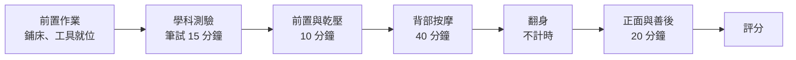

# IPE 芳香美體初級檢定規範與評分標準 v1.0

## 一、學科測驗規範

1. 題庫規劃：總題庫 **100 題**。
2. 測驗標準：單選題 25 題，答錯不倒扣，一題 4 分。
    - **初級**：滿分 100 分，及格 60 分
3. 測試時間：**15 分鐘**。（學科測驗開始 **5 分鐘後不准進場**，遲到視同缺考，以零分計。）
4. 外籍考生友善機制：採「口述考試」。由秘書部隨機抽 25 題出卷，並預先製作「錄音檔」進行測驗。（於考前 2 周完成試卷出題及錄製）

## 二、檢定須知

### ● 模特兒規範

1. 須年滿 **15 歲**，男女不限。
2. 不可配戴任何飾品、手錶、項鍊、戒指。
3. 請穿著**黑色後扣小可愛、黑色安全褲**裹毛巾並於考試前更換完畢。

### ● 考生規範

1. 長髮必須扎馬尾或包頭，瀏海不得蓋到眼睛，全程需帶**口罩**。
2. 必須穿**無 LOGO 白色檢定工作服**，長度需及膝（裡面白上衣）。
3. 不可配戴任何飾品、手錶、項鍊、戒指。摘不下的手環必須用繃帶固定住，不得晃動即不扣分。
4. 指甲不可有立體造型/貼鑽，長度不長於指肉 **0.2 公分**。

### ● 場地與設備準備

1. 檢定使用美體油品與酒精必須要有**完整的中文標籤**。
2. 測試時間及流程：入考場先檢查指甲與服裝儀容。前置作業先完成鋪床（奶茶色鋪床巾）─ 模特兒就位、工具就位。

## 三、考場與設備規範

### ● 考場配置

- 每場地容納 **4～12 床**。
- 人力配置：每四床安排 **1 位評審**並配置 **1 位評審長**。
- 考場提供：美容床椅、工作推車、延長線。

### ● 考生自備工具與耗材規定

1. 統一毛巾規定：必須使用「**奶茶色**」毛巾，需準備至少 **2 條大毛巾**、**1 條中毛巾**與 **12 條小毛巾**。
2. 專業工具：美體按摩油（基底油/精油）、酒精、衛生紙等。
3. 工具材料清單：參考下方附件。

---

## 四、術科檢定

<aside>
🟢

**初級：滿分 100 分，及格 60 分**

</aside>

### 術科測驗流程（總時長：70 分鐘）

**【前置作業】** 鋪床、模特兒就位、工具就位。（不計時，所有考生就位後開始計時。）

| **操作階段** | **時長** | **流程與檢核重點** | **配分** |
| --- | --- | --- | --- |
| 一、前置與乾壓 | 10 分鐘 | 1. 填寫顧客資料卡
2. 消毒雙手/背/足，準備油品
3. 乾壓（頭/肩頸/手/脊椎/側背/屁股/大腿/小腿） | 15% |
| 二、背部按摩 | 40 分鐘 | 1. 背部整體與背足部按摩
2. 含手部、肩頸、雙腿背面操作 | 40% |
| 【翻身階段】 | 不計時 | 協助翻身至正面。（注意大毛巾遮蔽，嚴防曝光） | 5% |
| 三、正面與善後 | 20 分鐘 | 1. 正面按摩（前胸/腹部/腿部）
2. 善後工作（毛巾按壓擦拭多餘油脂、環境復原） | 30% |
| 四、整體觀感 | 全程 | 依據下方明確扣分標準執行 | 10% |

### 考試流程圖

### 初級評分標準與配分（滿分 100 分）

| **項次** | **評分項目** | **評分內容與標準** | **配分** | **分工** | **給分梯度參考** |
| --- | --- | --- | --- | --- | --- |
| 1 | 填寫顧客資料卡 | 資料卡確實填寫 | 5 分 | 分區 | 完整填寫 5 分；少填一項扣 1 分；無檢定編號全扣 |
| 2 | 背部足部乾壓放鬆 | 背部至腿部放鬆，能精準掌握緊繃點；乾壓技法、力道服貼、經穴按壓 | 10 分 | 分區 | 背足全都有按 3 分；手法服貼 3 分；經穴正確 3 分（做得很好 9–10 分；不錯 7–8 分；尚可 5–6 分；勉強 3–4 分） |
| 3 | 背部整體展油與按摩 | 均勻展油，涵蓋背部整體，手技服貼流暢無卡頓；須 5 個手法以上 | 10 分 | 分區 | 勻油 3 個技法 3 分；頸部肩頸背部按壓服貼 3 分；按壓姿勢 3 分（做得很好 9–10 分；不錯 7–8 分；尚可 5–6 分；勉強 3–4 分） |
| 4 | 背部重點穴位與經絡 | 背部 5 個手法以上、背足 3 個手法以上；油量均勻、服貼 | 10 分 | 共評 | 背部 5 個動作 3 分；足部 5 個動作 3 分；少一個動作扣 1 分；按摩油滑度適中 3 分；油太少扣 1 分 |
| 5 | 背部─手部按摩技能 | 針對背部與手部肌肉進行有效放鬆；含手指按摩 | 10 分 | 共評 | 按摩力道服貼柔軟 3 分；手部含手指按摩 3 分；考生按壓姿勢 3 分；少一個動作扣 1 分 |
| 6 | 背部─足部按摩技能 | 雙腿背面推揉與安撫確實，方向朝向心臟 | 10 分 | 分區 | 按摩力道服貼柔軟 3 分；手法順暢熟練 3 分；考生按壓姿勢 3 分（做得很好 9–10 分；不錯 7–8 分；尚可 5–6 分；勉強 3–4 分） |
| 7 | 隱私維護（翻身） | 翻身與遮蔽動作流暢不走光 | 5 分 | 分區 | 翻身毛巾保護正確 5 分；遮蔽不足或走光酌扣 |
| 8 | 正面：肩頸前胸與腹部按摩 | 肩頸前胸按摩，腹部採順時針環保按摩；須 3 個手法以上 | 10 分 | 分區 | 肩頸前胸 3 個動作 3 分；按摩力道服貼柔軟 3 分；考生按壓姿勢 3 分；少一個動作扣 1 分 |
| 9 | 正面：腿部按摩技能 | 正面腿部放鬆，舒緩肌肉張力，手技流暢；須 3 個手法以上 | 10 分 | 分區 | 腿部 3 個動作 3 分；力道服貼柔軟 3 分；考生按壓姿勢 3 分；少一個動作扣 1 分 |
| 10 | 毛巾擦拭與環境善後 | 以毛巾確實按壓擦拭多餘油脂；工具歸位與垃圾分類 | 10 分 | 分區 | 擦拭乾淨且環境整潔 9–10 分；局部殘油或環境略凌亂 7–8 分；明顯殘油或環境雜亂 5 分以下 |
| 11 | 全程操作技術熟練度 | 操作者的操作按摩姿勢與身體施力點 | 10 分 | 共評 | 全程按摩流暢度 5 分；全程考生按摩技術施力點 5 分（做得很好 9–10 分；不錯 7–8 分；尚可 5–6 分；勉強 3–4 分；有操作不可給 0 分） |
|  | **技術考核小計** |  | **100 分** |  |  |

<aside>
💡

**分工說明**：「分區」由負責該區域的評審獨立評分；「共評」由全體評審共同觀察後合議評分。

</aside>

<aside>
📊

**給分梯度參考（下分點培訓）**：初階下分點 7 分；做得很好 9–10 分；不錯 7–8 分；尚可 5–6 分；勉強 3–4 分；有操作不可給 0 分。

</aside>

---

## 五、明確扣分標準

為確保評審標準一致，除各階段技術評分外，以下違規將直接扣減總分：

| **違規項目** | **違規情節說明** | **扣分** |
| --- | --- | --- |
| 應考期間手機鬧鈴響起 | 考生或模特兒手機響起（重大違規） | 扣 100 分 |
| 造成顧客受傷 | 使用錯誤技法造成受傷或操作錯誤部位（重大違規） | 扣 30 分 |
| 指甲違規 | 考生雙手指甲可做平面凝膠美甲，不可立體造型（操作時須配戴手套）指甲長度不可長於指肉 0.2 公分，違者扣分 | 扣 20 分 |
| 指甲違規（未戴手套） | 考生有做人工甲未戴手套操作 | 扣 10 分 |
| 飾品違規 | 考生及模特兒配戴任何飾品、手錶、項鍊、戒指 | 扣 20 分 |
| 毛巾違規 | 全部毛巾非單一素色（未統一使用奶茶色） | 扣 10 分 |
| 隱私曝光違規 | 未正確使用毛巾，使模特兒胸前美容衣曝光 | 扣 10 分 |
| 產品標示違規 | 產品中文標示不完整或過期（一項扣 5 分） | 扣 5 分 |
| 服儀違規（考生） | 考生未穿規定工作服 | 扣 5 分 |
| 服儀違規（模特兒） | 模特兒未穿黑色後扣小可愛及黑色安全褲、或不符合規定 | 扣 5 分 |
| 衛生違規 | 工作前手部未消毒、未戴口罩、頭髮未紮好（一項扣 5 分） | 扣 5 分 |
| 垃圾袋/消毒袋違規 | 未準備或未標示垃圾袋、待消毒袋、大待消毒袋（一項扣 5 分） | 扣 5 分 |
| 桌面整潔違規 | 工具使用未清潔擺放整齊 | 扣 5 分 |
| 衛生違規（消毒） | 背部足部未作消毒 | 扣 2 分 |
| 顧客保護違規（眼部） | 正面操作未用毛巾遮掩眼睛 | 扣 2 分 |
| 顧客保護違規（頭髮） | 操作時頭髮未用毛巾保護 | 扣 2 分 |

---

## 六、術科工具材料清單

| **項次** | **品項** | **數量** | **項次** | **品項** | **數量** |
| --- | --- | --- | --- | --- | --- |
| 1 | 工作服 | 1 | 9 | 工具籃 | 1 |
| 2 | 黑色後扣小可愛與黑色安全褲 | 1 | 10 | 口罩 | 操作時須配戴 |
| 3 | 室內拖鞋 | 2 | 11 | 鐵盤 | 1 |
| 4 | 待消毒袋．垃圾袋 | 1 | 12 | 玻璃缽 | 2 |
| 5 | 山口夾 | 2 | 13 | 洗臉巾 | 數張 |
| 6 | 鋪床巾（奶茶色） | 2 | 14 | 美體按摩基底油（需有合格中標） | 1 |
| 7 | 中毛巾（奶茶色） | 1 | 15 | 75% 酒精（需有合格中標） | 1 |
| 8 | 小毛巾（奶茶色） | 12 |  |  |  |

---

## 七、芳香美體顧客資料卡暨健康聲明書（附件）

<aside>
📋

**IPE 芳香美體顧客資料卡暨健康聲明書**

</aside>

###